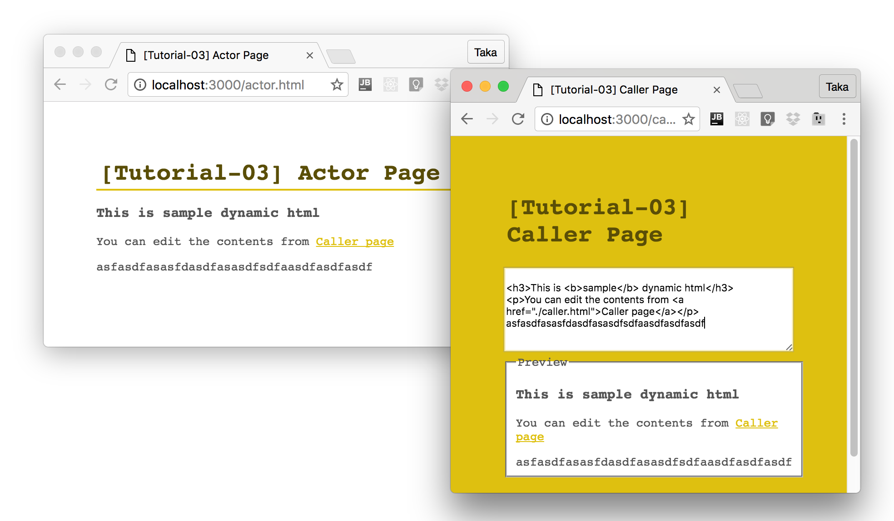

# [SUGOS Tutorial] 03 - Communication betweein Browsers

In [the Previous Tutorial](https://github.com/realglobe-Inc/sugos-tutorial/blob/master/dist/markdown/en/02%20-%20Using%20Event%20Emit.md), both of callers and actors run on Node.js.

This time, try it on browsers.

Typing HTML string in a textbox in one browser, and render the HTML in another browser on real time.


<a href="https://github.com/realglobe-Inc/sugos-tutorial/blob/master/dist/markdown/en/03%20-%20Communication%20betweein%20Browsers.md">
  </a>


## Try It Out

### Prepare project

For the beginning, prepare project directory as usual.

```bash
mkdir sugos-tutorial-03
cd sugos-tutorial-03
npm init -y

```

Then, install dependencies.

This time we needs some extra libraries to build user interface.

+ [React.js](https://facebook.github.io/react/)
+ [Babel](https://babeljs.io/docs/setup/)
+ [Browserify](https://github.com/substack/node-browserify)


```bash
# Install dependencies
npm install -S sugo-actor sugo-caller sugo-hub co asleep react react-dom babel-polyfill
# Install dev dependencies
npm install -D browserify browserify-incremental xtend babelify babel-preset-es2015 babel-preset-react
```

### Running Hub Server

Almost the same with the previous tutorial, but now we add `static` option to serve static files.

**hub.js**
```javascript
#!/usr/bin/env node

'use strict'

const sugoHub = require('sugo-hub')
const co = require('co')

co(function * () {
  let hub = sugoHub({
    /** Directory name for static files */
    static: [ 'public' ]
  })
  yield hub.listen(3000)
  console.log(`SUGO Cloud started at port: ${hub.port}`)
}).catch((err) => {
  console.error(err)
  process.exit(1)
})

```
```bash
node ./hub.js
```

### Creating Actor

Create an actor instance at `componentDidMount`, React.js lifecycle method, and declare a module with name `dynamicHTML`.
This module enables to rewrite HTML by accessing the component state.

**public/actor.jsx**
```jsx
/**
 * Sample JSX script for actor
 */
'use strict'

import 'babel-polyfill'
import sugoActor, {Module} from 'sugo-actor'
import React, {PropTypes as types} from 'react'
import ReactDOM from 'react-dom'

const ActorWorkspace = React.createClass({
  propTypes: {
    /** Key for actor */
    actorKey: types.string
  },

  getInitialState () {
    return {
      html: `
<h3>This is <b>sample</b> dynamic html</h3>
<p>You can edit the contents from <a href="./caller.html">Caller page</a></p>
`
    }
  },

  render () {
    const s = this
    let { state } = s
    return (
      <div className='actor-workspace'>
        <div dangerouslySetInnerHTML={ { __html: state.html } }></div>
      </div>
    )
  },

  componentDidMount () {
    const s = this
    let { actorKey } = s.props
    let actor = sugoActor({
      key: actorKey,
      modules: {
        // Define a module to handle HTML
        dynamicHTML: new Module({
          // Read HTML string
          read () {
            return s.state.html
          },
          // Write HTML string
          write (html) {
            s.setState({ html })
          }
        })
      }
    })
    actor.connect()
    s.actor = actor
  },

  componentWillUnmount () {
    const s = this
    let { actor } = s
    actor.disconnect()
  }

})

window.addEventListener('DOMContentLoaded', () => {
  ReactDOM.render(
    <ActorWorkspace actorKey='my-actor-01'/>,
    document.getElementById('actor-mount-root')
  )
})

```

Note that there is not `host` option with actor creating.
This is because the actor script it self is served by the hub. Actor find connection info by `localtion` object.

Then, create an HTML file to run this script.

**public/actor.html**
```html
<!DOCTYPE html>
<html>
<head>
  <title>[Tutorial-03] Actor Page</title>
  <meta name="viewport" content="width=device-width">
  <script src="./actor.js"></script>
  <style>
    body {
      color: #555;
      font-family: monospace;
      padding: 50px;
    }

    h1 {
      padding: 4px;
      border-bottom: 2px solid #DEC010;
      color: #5a4e07;
      margin: 0 0 16px;
    }

    a {
      color: #DEC010;
    }

    .container {
      max-width: 1024px;
      margin: 0 auto;
    }
  </style>
</head>
<body>
<header>
  <div class="container">
    <h1>[Tutorial-03] Actor Page</h1>
  </div>
</header>
<main>
  <div class="container">
    <div id="actor-mount-root"><!-- Mount root for react --></div>
  </div>
</main>
</body>
</html>
```


### Creating Caller

On caller side, call `.write()` method of the `dynamicHTML` defined in actor side when never text box changed.


**public/caller.jsx**
```jsx
/**
 * Sample JSX script for caller
 */
'use strict'

import 'babel-polyfill'
import sugoCaller, {Module} from 'sugo-caller'
import React, {PropTypes as types} from 'react'
import co from 'co'
import ReactDOM from 'react-dom'

const CallerWorkspace = React.createClass({
  propTypes: {
    /** Key for caller */
    actorKey: types.string
  },

  getInitialState () {
    return {
      html: ''
    }
  },

  render () {
    const s = this
    let { state } = s
    return (
      <div className='caller-workspace'>
        <textarea name="html"
                  placeholder="HTML to Write"
                  value={ state.html }
                  onChange={ (e) => s.updateHTML(e.target.value) }
        ></textarea>
        <fieldset>
          <legend>Preview</legend>
          <div dangerouslySetInnerHTML={ { __html: state.html } }></div>
        </fieldset>
      </div>
    )
  },

  componentDidMount () {
    const s = this
    let { actorKey } = s.props

    co(function * () {
      let caller = sugoCaller({})
      // Access to actor
      let actor = yield caller.connect(actorKey).catch((err) => {
        alert(`Failed to connect actor: ${actorKey}`)
      })
      // Get dynamic html module
      let dynamicHTML = actor.get('dynamicHTML')
      s.caller = caller
      s.dynamicHTML = dynamicHTML

      let html = yield dynamicHTML.read()
      s.setState({ html })
      s.forceUpdate()
    }).catch((err) => console.error(err))
  },

  componentWillUnmount () {
    const s = this
    let { caller } = s
    caller.disconnect()
  },

  updateHTML (html) {
    const s = this
    s.setState({ html })
    // Apply HTML to remote
    s.dynamicHTML.write(html)
    console.log('html', html)
  }

})

window.addEventListener('DOMContentLoaded', () => {
  ReactDOM.render(
    <CallerWorkspace actorKey='my-actor-01'/>,
    document.getElementById('caller-mount-root')
  )
})

```


**public/caller.html**
```html
<!DOCTYPE html>
<html>
<head>
  <title>[Tutorial-03] Caller Page</title>
  <meta name="viewport" content="width=device-width">
  <script src="./caller.js"></script>
  <style>
    html {
      background: #DEC010;
    }

    body {
      color: #555;
      font-family: monospace;
      padding: 50px;
    }

    h1 {
      padding: 4px;
      border-bottom: 2px solid #DEC010;
      color: #5a4e07;
      margin: 0 0 16px;
    }

    a {
      color: #DEC010;
    }

    .container {
      max-width: 1024px;
      margin: 0 auto;
    }

    textarea {
      width: 100%;
      min-height: 94px;
      box-sizing: border-box;
      outline-color: #DEC010;
    }

    fieldset {
      background: white;
    }
  </style>
</head>
<body>
<header>
  <div class="container">
    <h1>[Tutorial-03] Caller Page</h1>
  </div>
</header>
<main>
  <div class="container">
    <div id="caller-mount-root"><!-- Mount root for react --></div>
  </div>
</main>
</body>
</html>
```


### Build the script

The jsx script needs to be compiled. Babel and Browserify would do this.


**build.js**
```js
#!/usr/bin/env node

/**
 * Build script
 */
'use strict'

const fs = require('fs')
const co = require('co')
const browserify = require('browserify')
const browserifyInc = require('browserify-incremental')
const xtend = require('xtend')

function bundle (src, dest) {
  return new Promise((resolve, reject) => {
    console.log(`Bundling ${src}...`)
    let b = browserify(src, xtend(browserifyInc.args, {
      // your custom opts
    })).transform('babelify', {
      babelrc: false,
      presets: [ 'es2015', 'react' ]
    })

    browserifyInc(b, { cacheFile: './tmp/browserify-cache.json' })

    b
      .bundle()
      .pipe(fs.createWriteStream(dest))
      .on('error', (err) => {
        console.error(err)
        reject(err)
      })
      .on('close', () => {
        console.log(`File bundled: ${dest}`)
        resolve()
      })
  })
}

co(function * () {
  yield bundle('public/actor.jsx', 'public/actor.js')
  yield bundle('public/caller.jsx', 'public/caller.js')
})


```


```bash
node ./build.js
```

### Play with Browser

With the hub server running, open actor html from browser:

[http://localhost:3000/actor.html](http://localhost:3000/actor.html)


Then, open caller html as well

[http://localhost:3000/caller.html](http://localhost:3000/caller.html)

Type something on caller html textarea and actor html will show the result.





## Conclusion

+ Callers and actors supports browser
+ Hub has `static` option to serve static files
+ Callers and actors find host from `location` object by default.

Code snippets of this tutorial are also [available here](https://github.com/realglobe-Inc/sugos-tutorial/tree/master/example/tutorial-03)


## You may Want to Read

+ Previous Tutorial: [02 - Using Event Emit](https://github.com/realglobe-Inc/sugos-tutorial/blob/master/dist/markdown/en/02%20-%20Using%20Event%20Emit.md)
+ Next Tutorial: [04 - Module as npm package](https://github.com/realglobe-Inc/sugos-tutorial/blob/master/dist/markdown/en/04%20-%20Module%20as%20npm%20package.md)

## Links

+ [SUGOS](https://github.com/realglobe-Inc/sugos)
+ [SUGO-Hub](https://github.com/realglobe-Inc/sugo-hub)
+ [SUGO-Actor](https://github.com/realglobe-Inc/sugo-actor)
+ [SUGO-Caller](https://github.com/realglobe-Inc/sugo-caller)
+ [React](https://facebook.github.io/react/)
+ [Babel](https://babeljs.io/docs/setup/)
+ [Browserify](https://github.com/substack/node-browserify)
+ Tutorials
  + [00 - Let us begin with SUGOS](https://github.com/realglobe-Inc/sugos-tutorial/blob/master/dist/markdown/en/00%20-%20Let%20us%20begin%20with%20SUGOS.md)
  + [01 - Hello World, as always](https://github.com/realglobe-Inc/sugos-tutorial/blob/master/dist/markdown/en/01%20-%20Hello%20World%2C%20as%20always.md)
  + [02 - Using Event Emit](https://github.com/realglobe-Inc/sugos-tutorial/blob/master/dist/markdown/en/02%20-%20Using%20Event%20Emit.md)
  + [03 - Communication betweein Browsers](https://github.com/realglobe-Inc/sugos-tutorial/blob/master/dist/markdown/en/03%20-%20Communication%20betweein%20Browsers.md)
  + [04 - Module as npm package](https://github.com/realglobe-Inc/sugos-tutorial/blob/master/dist/markdown/en/04%20-%20Module%20as%20npm%20package.md)
