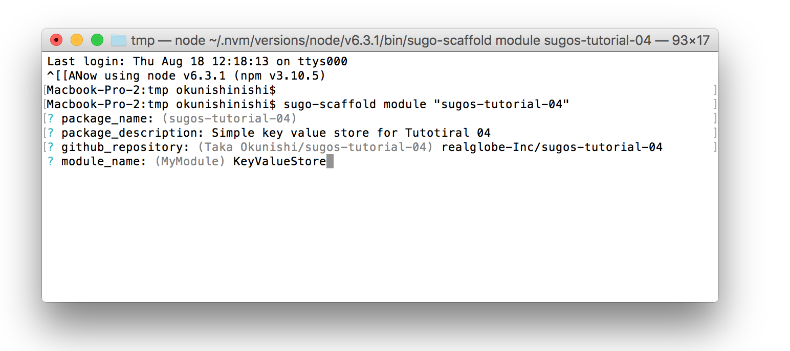

# [SUGOS Tutorial] 04 - Module as npm package

In [the Previous Tutorial](https://github.com/realglobe-Inc/sugos-tutorial/blob/master/dist/markdown/en/03%20-%20Communication%20betweein%20Browsers.md), we learned how to run callers and actors on browser.

Until now, we declare most modules on actor creation.
But most cases in the real world you need to reuse module on another project.

So, this tutorial shows how to create publish a module as npm package. What we are making is a simple Key-Value-Store which save data in to local file system.


<a href="https://github.com/realglobe-Inc/sugos-tutorial/blob/master/dist/markdown/en/04%20-%20Module%20as%20npm%20package.md">
</a>


## Before Starting

Install [sugo-scaffold](https://github.com/realglobe-Inc/sugo-scaffold) CLI tool to generate project structure.

```bash
# Install as global module
npm install -g sugo-scaffold

# Show version to check if the installation succeeded
sugo-scaffold --version
```

## Try It Out

### Generating Scaffold

Run command `sugo-scaffold <type> <dircotry>` on you terminal and it starts interactive shell.

```bash
# Create a module project
sugo-scaffold module "sugos-tutorial-04"
cd sugos-tutorial-04
npm install
npm test
```

Set `module_name` as "KeyValueStore".



When you answer all questions, project scaffold will be generated.


### Implement the Module


See a file named "lib/key_value_store.js" in the generated directory.

```javascript
/**
 * KeyValueStore class
 * @class KeyValueStore
 * @augments Module
 * @param {Object} config - Configuration
 */
'use strict'

const { Module } = require('sugo-module-base')
const { name, version, description } = require('../package.json')

const co = require('co')
const { hasBin } = require('sg-check')
const debug = require('debug')('sugo:module:demo-module')

/** @lends KeyValueStore */
class KeyValueStore extends Module {
  constructor (config = {}) {
    debug('Config: ', config)
    super(config)
  }

  /**
   * Ping a message.
   * @param {string} pong
   * @returns {Promise.<string>} - Pong message
   */
  ping (pong = 'pong') {
    return co(function * pingAck () {
      return pong // Return result to a remote caller.
    })
  }

  /**
   * Assert actor system requirements.
   * @throws {Error} - System requirements failed error
   * @returns {Promise.<boolean>} - Asserted state
   */
  assert () {
    const bins = [ 'node' ] // Required commands
    return co(function * assertAck () {
      yield hasBin.assertAll(bins)
      return true
    })
  }

  /**
   * Module specification
   * @see https://github.com/realglobe-Inc/sg-schemas/blob/master/lib/module_spec.json
   */
  get $spec () {
    return {
      name,
      version,
      desc: description,
      methods: {
        ping: {
          desc: 'Test the reachability of a module.',
          params: [
            { name: 'pong', type: 'string', desc: 'Pong message to return' }
          ],
          return: {
            type: 'string',
            desc: 'Pong message'
          }
        },

        assert: {
          desc: 'Test if the actor fulfills system requirements',
          params: [],
          throws: [ {
            type: 'Error',
            desc: 'System requirements failed'
          } ],
          return: {
            type: 'boolean',
            desc: 'System is OK'
          }
        }
      },

      events: null
    }
  }
}

module.exports = KeyValueStore

```

There are two methods defined by default.

`.ping()` to test the reachability、`.assert()` to test the environment.

Run `npm test` to test the module.

And you may notice the getter defined in the module class.
`get $spec () { /* ... */ }`

This is an optional settings to tell how this module works.


Well, let's begin to define methods for the KeyValueStore.

```javascript
/** ... */
'use strict'

const { Module } = require('sugo-module-base')
const { name, version, description } = require('../package.json')

const co = require('co')
const fs = require('fs')
const { hasBin } = require('sg-check')
const debug = require('debug')('sugo:module:demo-module')

/** @lends KeyValueStore */
class KeyValueStore extends Module {

  // Add "filename" parameter on constructor

  constructor (config = {}) {
    let { filename = 'kv.json' } = config
    debug('Config: ', config)
    super(config)
    const s = this
    s.filename = filename
  }

  /** ... */
  ping (pong = 'pong') { /* ... */ }

  /** ... */
  assert () { /* ... */ }

  // Define methods for Key-vale store

  set (key, value) {
    const s = this
    return co(function * () {
      let data = yield s._read().catch(() => ({}))
      data[ key ] = value
      return yield s._write(data)
    })
  }

  get (key) {
    const s = this
    return co(function * () {
      let data = yield s._read()
      return data[ key ]
    })
  }

  del (key) {
    const s = this
    return co(function * () {
      let data = yield s._read()
      delete data[ key ]
      return yield s._write(data)
    })
  }

  // Private function to read data file
  // Methods with "_" is not exposed to remote caller
  _read () {
    let { filename } = this
    return new Promise((resolve, reject) =>
      fs.readFile((filename), (err, content) => err ? reject(err) : resolve(content))
    ).then(JSON.parse)
  }

  // Private function to write data file
  // Methods with "_" is not exposed to remote caller
  _write (data) {
    let { filename } = this
    return new Promise((resolve, reject) =>
      fs.writeFile(filename, JSON.stringify(data), (err) => err ? reject(err) : resolve())
    )
  }

  /** ... */
  get $spec () { /* ... */ }
}

module.exports = KeyValueStore

```


Define constructor to take `filename`, the path of json file to store data.
Then define,

+ `._read()` and `._write(data)` to access data internally.
+ `.set(key, value)`、`.get(key)`、`.del(key)` method for public

Not that methods start with underscore are marked as private, and you cannot call it from callers.


And don't forget to implement `$spec` for docs.

```javascript
/** ... */
'use strict'

const { Module } = require('sugo-module-base')
const { name, version, description } = require('../package.json')

const co = require('co')
const fs = require('fs')
const { hasBin } = require('sg-check')
const debug = require('debug')('sugo:module:demo-module')

/** @lends KeyValueStore */
class KeyValueStore extends Module {
  constructor (config = {}) { /* ... */ }

  /** ... */
  ping (pong = 'pong') { /* ... */ }

  /** ... */
  assert () { /* ... */ }

  set (key, value) { /* ... */ }

  get (key) { /* ... */ }

  del (key) { /* ... */ }

  // Private function to read data file
  // Methods with "_" is not exposed to remote caller
  _read () { /* ... */ }

  // Private function to write data file
  // Methods with "_" is not exposed to remote caller
  _write (data) { /* ... */ }

  /**
   * Module specification
   * @see https://github.com/realglobe-Inc/sg-schemas/blob/master/lib/module_spec.json
   */
  get $spec () {
    return {
      name,
      version,
      desc: description,
      methods: {
        ping: { /* ... */ },

        assert: { /* ... */ },

        set: {
          desc: 'Set key value',
          params: [
            { name: 'key', type: 'string', desc: 'Key to set' },
            { name: 'value', type: 'string', desc: 'value to set' }
          ]
        },

        get: {
          desc: 'Get by key ',
          params: [
            { name: 'key', type: 'string', desc: 'Key to set' }
          ],
          return: { type: 'string', desc: 'Found value' }
        },

        del: {
          desc: 'Delete by key ',
          params: [
            { name: 'key', type: 'string', desc: 'Key to set' }
          ]
        }
      },
      events: null
    }
  }
}

module.exports = KeyValueStore

```


### Testing the Module

See the "test/key_value_store_test.js" in the generated directory.

```javascript
/**
 * Test case for demoModule.
 * Runs with mocha.
 */
'use strict'

const KeyValueStore = require('../lib/key_value_store.js')
const assert = require('assert')
const co = require('co')
const { EventEmitter } = require('events')
const sgSchemas = require('sg-schemas')
const sgValidator = require('sg-validator')

describe('demo-module', function () {
  this.timeout(3000)

  before(() => co(function * () {

  }))

  after(() => co(function * () {

  }))

  it('Get module spec', () => co(function * () {
    let module = new KeyValueStore({ $emitter: new EventEmitter() })
    assert.ok(module)

    let { $spec } = module
    let specError = sgValidator(sgSchemas.moduleSpec).validate($spec)
    assert.ok(!specError)
  }))

  it('Try ping-pong', () => co(function * () {
    let module = new KeyValueStore({ $emitter: new EventEmitter() })
    let pong = yield module.ping('pong')
    assert.equal(pong, 'pong')
  }))

  it('Do assert', () => co(function * () {
    let module = new KeyValueStore({ $emitter: new EventEmitter() })
    let caught
    try {
      yield module.assert({})
    } catch (err) {
      caught = err
    }
    assert.ok(!caught)
  }))

  it('Compare methods with spec', () => co(function * () {
    let module = new KeyValueStore({ $emitter: new EventEmitter() })
    let { $spec } = module
    let implemented = Object.getOwnPropertyNames(KeyValueStore.prototype)
      .filter((name) => !/^[\$_]/.test(name))
      .filter((name) => !~[ 'constructor' ].indexOf(name))
    let described = Object.keys($spec.methods).filter((name) => !/^[\$_]/.test(name))
    for (let name of implemented) {
      assert.ok(!!~described.indexOf(name), `${name} method should be described in spec`)
    }
    for (let name of described) {
      assert.ok(!!~implemented.indexOf(name), `${name} method should be implemented`)
    }
  }))
})

/* global describe, before, after, it */

```

Add some tests here

```javascript
/**
 * Test case for demoModule.
 * Runs with mocha.
 */
'use strict'

const KeyValueStore = require('../lib/key_value_store.js')
const assert = require('assert')
const co = require('co')
const { EventEmitter } = require('events')
const sgSchemas = require('sg-schemas')
const sgValidator = require('sg-validator')

describe('demo-module', function () {
  this.timeout(3000)

  before(() => co(function * () {

  }))

  after(() => co(function * () {

  }))

  it('Get module spec', () => co(function * () { /* ... */ }))

  it('Try ping-pong', () => co(function * () { /* ... */ }))

  it('Do assert', () => co(function * () { /* ... */ }))

  it('Compare methods with spec', () => co(function * () { /* ... */ }))

  it('Do get/set/del', () => co(function * () {
    let module = new KeyValueStore({
      filename: `${__dirname}/../testing-store.json`,
      $emitter: new EventEmitter()
    })
    yield module.set('foo', 'This is foo')
    {
      let foo = yield module.get('foo')
      assert.equal(foo, 'This is foo')
    }
    yield module.del('foo')
    {
      let foo = yield module.get('foo')
      assert.equal(foo, undefined)
    }
  }))
})

/* global describe, before, after, it */

  ```


Then, run it.

```bash
npm test
```


If you succeed `npm publish` to register the package.

Then, use it from another packages

```javascript
#!/usr/bin/env node

/**
 * Example usage to register module on actor
 * @see https://github.com/realglobe-Inc/sugo-actor
 */
'use strict'

const { KeyValueStore } = require('sugos-tutorial-04')
const sugoActor = require('sugo-actor')
const co = require('co')

co(function * () {
  let actor = sugoActor('http://my-sugo-cloud.example.com/actors', {
    key: 'my-actor-01',
    modules: {
      // Register the module
      kvs: new KeyValueStore({
        filename: 'kv.json'
      })
    }
  })
  yield actor.connect()
}).catch((err) => console.error(err))

```


## Conclusion

+ Use [sugo-scaffold](https://github.com/realglobe-Inc/sugo-scaffold) to generate project structure
+ Write `$spec` to describe the module (optional)
+ Method starts with underscore works as private (Cannot call from callers)
+ You can test the module without hub nor callers

Code snippets of this tutorial are also [available here](https://github.com/realglobe-Inc/sugos-tutorial/tree/master/example/tutorial-04)


## You may Want to Read

+ Previous Tutorial: [03 - Communication betweein Browsers](https://github.com/realglobe-Inc/sugos-tutorial/blob/master/dist/markdown/en/03%20-%20Communication%20betweein%20Browsers.md)
+ Next Tutorial: []()

## Links

+ [SUGOS](https://github.com/realglobe-Inc/sugos)
+ [SUGO-Actor](https://github.com/realglobe-Inc/sugo-actor)
+ [SUGO-Scaffold](https://github.com/realglobe-Inc/sugo-scaffold)
+ Tutorials
  + [00 - Let us begin with SUGOS](https://github.com/realglobe-Inc/sugos-tutorial/blob/master/dist/markdown/en/00%20-%20Let%20us%20begin%20with%20SUGOS.md)
  + [01 - Hello World, as always](https://github.com/realglobe-Inc/sugos-tutorial/blob/master/dist/markdown/en/01%20-%20Hello%20World%2C%20as%20always.md)
  + [02 - Using Event Emit](https://github.com/realglobe-Inc/sugos-tutorial/blob/master/dist/markdown/en/02%20-%20Using%20Event%20Emit.md)
  + [03 - Communication betweein Browsers](https://github.com/realglobe-Inc/sugos-tutorial/blob/master/dist/markdown/en/03%20-%20Communication%20betweein%20Browsers.md)
  + [04 - Module as npm package](https://github.com/realglobe-Inc/sugos-tutorial/blob/master/dist/markdown/en/04%20-%20Module%20as%20npm%20package.md)
