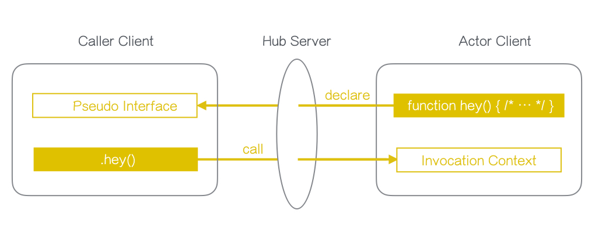

# 【SUGOS】チュートリアル001: SUGOSことはじめ


## これはなにか

[SUGOS](https://github.com/realglobe-Inc/sugos)とは

+ 遠隔関数呼び出し（RPC: Remote Procedure Call）を実現するフレームワーク
+ 関数定義を動的に共有することで、ネットワーク越しであることを意識しなくて良くなる
+ 主に[Node.js](https://nodejs.org/en/)で実装されている
+ [EventEmitter](https://nodejs.org/api/events.html#events_events)形式でのイベント駆動な記述も可能
+ [株式会社リアルグローブ](http://realglobe.jp/)が開発


## これでできること

SUGOSを使うと、あるクライアント上で定義した関数が、他のクライアントからいきなり使えるようになります。




例えば、関数を提供する側のクライアント（Actor) において、

+ メソッドを持つModuleを宣言 ( `tableTennis#ping` )
+ クライアント名(key)を宣言し、仲介となるhubサーバに接続 ( `my-actor-01@example.sugo-hub.com` )

```javascript
'use strict'

const co = require('co')
const sugoActor = require('sugo-actor')
const { Module } = sugoActor

co(function * () {
  // Define a module with methods
  let tableTennis = new Module({
    ping (pong) {
      return `"${pong}" from actor!`
    }
  })

  // Create an actor client instance
  let actor = sugoActor({
    host: 'example.sugo-hub.com',
    key: 'my-actor-01',
    modules: { tableTennis }
  })

  // Connect to hub server
  yield actor.connect()
}).catch((err) => console.error(err))

```

すると、

関数を提供する側の呼び出す側クライアント (Caller)から、Actorが提供するModuleにアクセスできるようになります。


```javascript
'use strict'

const sugoCaller = require('sugo-caller')
const co = require('co')

co(function * () {
  let caller = sugoCaller({
    host: 'example.sugo-hub.com'
  })
  // Connect to an actor with key
  let actor01 = yield caller.connect('my-actor-01')

  {
    // Get a module of the actor
    let tableTennis = actor01.get('tableTennis')
    let pong = yield tableTennis.ping('hey!')
    console.log(pong) // -> `"hey!" from call!`
  }
}).catch((err) => console.error(err))

```

`.ping()`自体はCaller側のJavascriptではどこにも宣言されていませんが、Actorから受け取った定義を基にして動的に生成されます。

また、一方的な関数呼び出しだけではなく、 Node.jsの[EventEmitter](https://nodejs.org/api/events.html#events_events)を用いたイベント通知もサポートしています。


## これはどういう仕組みか

### 主なコンポネーント

| コンポーネント | 役割 |
| ------------ | --- |
| [SUGO-Hub](https://github.com/realglobe-Inc/sugo-hub) | ActorとCallerの通信をとり持つサーバ。内部的には[Socket.IO](http://socket.io/)と[Koa](https://github.com/koajs/koa)を利用している |
| [SUGO-Actor](https://github.com/realglobe-Inc/sugo-actor) | 関数実行を担うクライアント。`key`によって一意に識別される。 |
| [SUGO-Caller](https://github.com/realglobe-Inc/sugo-caller) | 関数呼び出しを担うクライアント。接続先のActorに合わせて動的にJavascriptの関数を生成する |


ActorとCallerはそれぞれWebSocketでHubと接続します。


&nbsp;&nbsp;&nbsp;&nbsp;**Caller** **<----->** **Hub** **<----->** **Actor**


Callerは接続時にActorからModuleの定義情報を受け取り、それを元にJavascript関数を動的に生成します。

Caller側で関数を実行すると、関数名や引数などの情報が裏でJSONに変換され、Hubを介して接続先のActorに届きます。
Actor側では受けとった情報を元に対象の関数を呼び出し、その結果をまたCaller側に返します。

それぞれの関数はJavascriptの[async/await](https://github.com/yortus/asyncawait#guide-to-asyncawait-v10)を沿って実装されており、
ネットワークの時差をあまり意識せずにプログラムがかけるようになっています。

## これの利点

+ 機能単位でWebアプリケーション設計ができる
+ ネットワークをあまり意識しなくていい
+ Javascriptだけで直感的にかける

## これに関するリンク

+ [SUGOS](https://github.com/realglobe-Inc/sugos)
+ [SUGO-Hub](https://github.com/realglobe-Inc/sugo-hub)
+ [SUGO-Actor](https://github.com/realglobe-Inc/sugo-actor)
+ [SUGO-Caller](https://github.com/realglobe-Inc/sugo-caller)
+ [Realglobe,Inc](http://realglobe.jp/)
