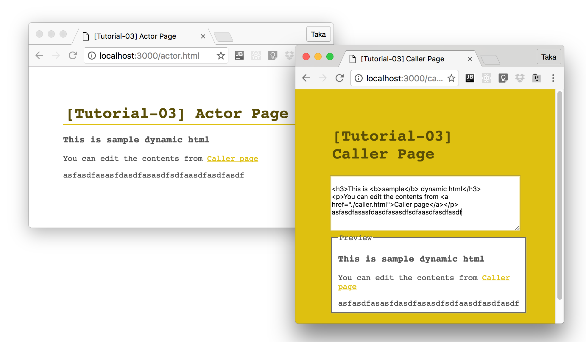

# 【SUGOS】チュートリアル03: Browser間でやり取りする

[前回のチュートリアル](https://github.com/realglobe-Inc/sugos-tutorial/tree/master/example/tutorial-02)では、Caller/Actorのやり取りをNode.js上で行ないました。

今回はブラウザ間での呼び出しを実装してみます。
一方のウィンドウでテキストボックスにHTML文字列を打ち込むと、別のウィンドウにリアルタイムでレンダリングされて表示される、というものを作ります。

## 実装してみる

### プロジェクトの用意

前回と同様に、まずはプロジェクトディレクトリを用意します。

```bash
mkdir sugos-tutorial-03
cd sugos-tutorial-03
npm init -y

```

次に、必要なパッケージをインストールします。

今回はUIを作成するので、SUGOSに加え、

+ [React.js](https://facebook.github.io/react/)
+ [Babel](https://babeljs.io/docs/setup/)
+ [Browserify](https://github.com/substack/node-browserify)

と等を利用します。

```bash
npm install -S sugo-actor sugo-caller sugo-hub co asleep react react-dom babel-polyfill
npm install -D browserify babelify babel-preset-es2015 babel-preset-react
```

### Hubサーバを立てる

Hubサーバは前回とほぼ同様ですが、新たに`static`オプションを追加します。
ここにディレクトリ名を指定することで、静的ファイルの配布が可能になります。

**hub.js**
```javascript
#!/usr/bin/env node

'use strict'

const sugoHub = require('sugo-hub')
const co = require('co')

co(function * () {
  let hub = yield sugoHub({
    port: 3000,
    /** Directory name for static files */
    static: [ 'public' ]
  })
  console.log(`SUGO Cloud started at port: ${hub.port}`)
}).catch((err) => {
  console.error(err)
  process.exit(1)
})

```
```bash
node ./hub.js
```

### Actorを用意する

Actor側のブラウザ用スクリプトを用意します。
`componentDidMount`のタイミングでactorのインスタンスを作成し、その中で`dynamicHTML`という名前をモジュールを宣言しています。
このモジュールはComponentのstateにアクセスすることで、動的にHTMLを書き換える機能を持ちます。

**public/actor.jsx**
```jsx
/**
 * Sample JSX script for actor
 */
'use strict'

import 'babel-polyfill'
import sugoActor, {Module} from 'sugo-actor'
import React, {PropTypes as types} from 'react'
import ReactDOM from 'react-dom'

const ActorWorkspace = React.createClass({
  propTypes: {
    /** Key for actor */
    actorKey: types.string
  },

  getInitialState () {
    return {
      html: `
<h3>This is <b>sample</b> dynamic html</h3>
<p>You can edit the contents from <a href="./caller.html">Caller page</a></p>
`
    }
  },

  render () {
    const s = this
    let { state } = s
    return (
      <div className='actor-workspace'>
        <div dangerouslySetInnerHTML={ { __html: state.html } }></div>
      </div>
    )
  },

  componentDidMount () {
    const s = this
    let { actorKey } = s.props
    let actor = sugoActor({
      key: actorKey,
      modules: {
        // Define a module to handle HTML
        dynamicHTML: new Module({
          // Read HTML string
          read () {
            return s.state.html
          },
          // Write HTML string
          write (html) {
            s.setState({ html })
          }
        })
      }
    })
    actor.connect()
    s.actor = actor
  },

  componentWillUnmount () {
    const s = this
    let { actor } = s
    actor.disconnect()
  }

})

window.addEventListener('DOMContentLoaded', () => {
  ReactDOM.render(
    <ActorWorkspace actorKey='my-actor-01'/>,
    document.getElementById('actor-mount-root')
  )
})

```

次に、このスクリプトを走らせるためのHTMLを用意します。

**public/actor.html**
```html
<!DOCTYPE html>
<html>
<head>
  <title>[Tutorial-03] Actor Page</title>
  <meta name="viewport" content="width=device-width">
  <script src="./actor.js"></script>
  <style>
    body {
      color: #555;
      font-family: monospace;
      padding: 50px;
    }

    h1 {
      padding: 4px;
      border-bottom: 2px solid #DEC010;
      color: #5a4e07;
      margin: 0 0 16px;
    }

    a {
      color: #DEC010;
    }

    .container {
      max-width: 1024px;
      margin: 0 auto;
    }
  </style>
</head>
<body>
<header>
  <div class="container">
    <h1>[Tutorial-03] Actor Page</h1>
  </div>
</header>
<main>
  <div class="container">
    <div id="actor-mount-root"><!-- Mount root for react --></div>
  </div>
</main>
</body>
</html>
```


### Callerを用意する

Caller側のブラウザ用スクリプトを用意します。

テキストボックスに入力が変更されたらその内容を、先程Actorで宣言した`dynamicHTML`の`.write()`メソッドに渡します。
これにより、編集内容をリアルタイムに反映するということが実現します。


**public/caller.jsx**
```jsx
/**
 * Sample JSX script for caller
 */
'use strict'

import 'babel-polyfill'
import sugoCaller, {Module} from 'sugo-caller'
import React, {PropTypes as types} from 'react'
import co from 'co'
import ReactDOM from 'react-dom'

const CallerWorkspace = React.createClass({
  propTypes: {
    /** Key for caller */
    actorKey: types.string
  },

  getInitialState () {
    return {
      html: ''
    }
  },

  render () {
    const s = this
    let { state } = s
    return (
      <div className='caller-workspace'>
        <textarea name="html"
                  placeholder="HTML to Write"
                  value={ state.html }
                  onChange={ (e) => s.updateHTML(e.target.value) }
        ></textarea>
        <fieldset>
          <legend>Preview</legend>
          <div dangerouslySetInnerHTML={ { __html: state.html } }></div>
        </fieldset>
      </div>
    )
  },

  componentDidMount () {
    const s = this
    let { actorKey } = s.props

    co(function * () {
      let caller = sugoCaller({})
      // Access to actor
      let actor = yield caller.connect(actorKey).catch((err) => {
        alert(`Failed to connect actor: ${actorKey}`)
      })
      // Get dynamic html module
      let dynamicHTML = actor.get('dynamicHTML')
      s.caller = caller
      s.dynamicHTML = dynamicHTML

      let html = yield dynamicHTML.read()
      s.setState({ html })
      s.forceUpdate()
    }).catch((err) => console.error(err))
  },

  componentWillUnmount () {
    const s = this
    let { caller } = s
    caller.disconnect()
  },

  updateHTML (html) {
    const s = this
    s.setState({ html })
    // Apply HTML to remote
    s.dynamicHTML.write(html)
    console.log('html', html)
  }

})

window.addEventListener('DOMContentLoaded', () => {
  ReactDOM.render(
    <CallerWorkspace actorKey='my-actor-01'/>,
    document.getElementById('caller-mount-root')
  )
})

```

こちらもHTMLを用意します。

**public/caller.html**
```html
<!DOCTYPE html>
<html>
<head>
  <title>[Tutorial-03] Caller Page</title>
  <meta name="viewport" content="width=device-width">
  <script src="./caller.js"></script>
  <style>
    html {
      background: #DEC010;
    }

    body {
      color: #555;
      font-family: monospace;
      padding: 50px;
    }

    h1 {
      padding: 4px;
      border-bottom: 2px solid #DEC010;
      color: #5a4e07;
      margin: 0 0 16px;
    }

    a {
      color: #DEC010;
    }

    .container {
      max-width: 1024px;
      margin: 0 auto;
    }

    textarea {
      width: 100%;
      min-height: 94px;
      box-sizing: border-box;
      outline-color: #DEC010;
    }

    fieldset {
      background: white;
    }
  </style>
</head>
<body>
<header>
  <div class="container">
    <h1>[Tutorial-03] Caller Page</h1>
  </div>
</header>
<main>
  <div class="container">
    <div id="caller-mount-root"><!-- Mount root for react --></div>
  </div>
</main>
</body>
</html>
```


### Buildする

用意したJSXファイルはそのままではブラウザで実行できません。BabelとBrowserifyを使ってコンパイル・バンドルします。


**build.js**
```js
#!/usr/bin/env

/**
 * Build script
 */
'use strict'

const fs = require('fs')
const browserify = require('browserify')


function bundle (src, dest) {
  browserify(src)
    .transform('babelify', {
      babelrc: false,
      presets: [ 'es2015', 'react' ]
    })
    .bundle()
    .pipe(fs.createWriteStream(dest))
    .on('close', () => {
      console.log(`File generated: ${dest}`)
    })
}

bundle('public/actor.jsx', 'public/actor.js')
bundle('public/caller.jsx', 'public/caller.js')

```


```bash
node ./hub.js
```

### ブラウザから確認する

Hubが起動している状態で、Actor側HTMLをブラウザから開きます。

[http://localhost:3000/actor.html](http://localhost:3000/actor.html)


続いて、Caller側HTMLをブラウザの別タブで開きます。

[http://localhost:3000/caller.html](http://localhost:3000/caller.html)

Caller側のテキストエリアを編集すると、Actorブラウザにリアルタイムで反映されていることが確認できたら成功です。





## リンク

+ [SUGOS](https://github.com/realglobe-Inc/sugos)
+ [SUGO-Hub](https://github.com/realglobe-Inc/sugo-hub)
+ [SUGO-Actor](https://github.com/realglobe-Inc/sugo-actor)
+ [SUGO-Caller](https://github.com/realglobe-Inc/sugo-caller)
+ [React](https://facebook.github.io/react/)
+ [Babel](https://babeljs.io/docs/setup/)
+ [Browserify](https://github.com/substack/node-browserify)
+ Tutorials
  + [00.SUGOSことはじめ](https://github.com/realglobe-Inc/sugos-tutorial/blob/master/dist/markdown/ja/00.SUGOS%E3%81%93%E3%81%A8%E3%81%AF%E3%81%98%E3%82%81.md)
  + [01.Hello Worldしてみる](https://github.com/realglobe-Inc/sugos-tutorial/blob/master/dist/markdown/ja/01.Hello%20World%E3%81%97%E3%81%A6%E3%81%BF%E3%82%8B.md)
  + [02.Event Emitしてみる](https://github.com/realglobe-Inc/sugos-tutorial/blob/master/dist/markdown/ja/02.Event%20Emit%E3%81%97%E3%81%A6%E3%81%BF%E3%82%8B.md)
  + [03.Browser間でやり取りする](https://github.com/realglobe-Inc/sugos-tutorial/blob/master/dist/markdown/ja/03.Browser%E9%96%93%E3%81%A7%E3%82%84%E3%82%8A%E5%8F%96%E3%82%8A%E3%81%99%E3%82%8B.md)
